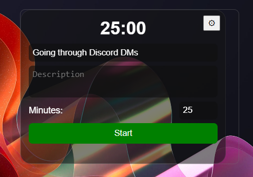
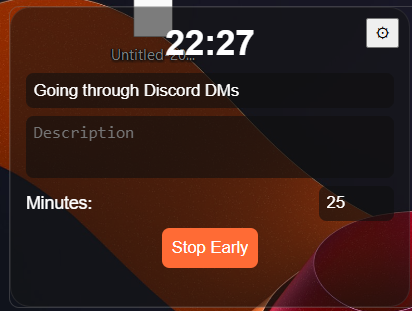
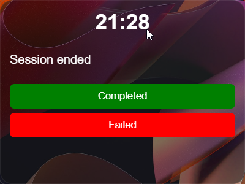
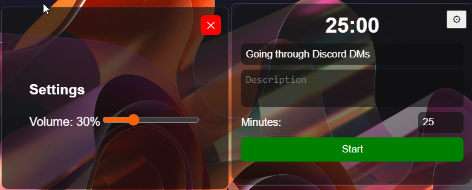

# Pomodoro Overlay

A transparent, top-right anchored Pomodoro timer that stays on top of other windows.

## Features
- Floating overlay with drag support.
- Configurable durations and descriptions.
- Random sound (Place your own in .\src\assets\sounds) notifications upon completion.
- Local session logging (Markdown files in .\src-tauri\logs).
- Volume control via settings window.

## Setup
Make sure you have Rust and Node.js installed, then:
1. `git clone https://github.com/den4iksum/PomodoroOverlay`
2. `cd PomodoroOverlay`
3. `npm install`
4. `npm run tauri dev` or just open with start.bat in project directory

## Tech Stack
- **Frontend:** React + TypeScript + Vite
- **Backend:** Rust + Tauri
- **Styling:** CSS (Glassmorphism)